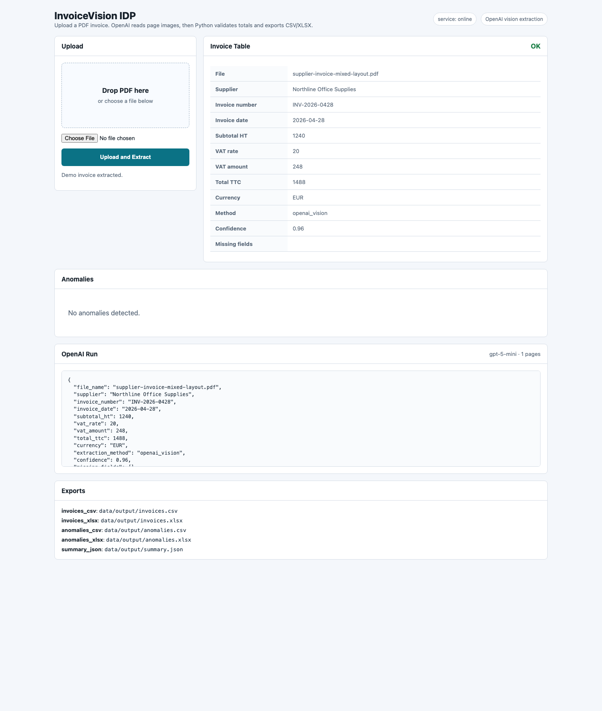

# InvoiceVision IDP

InvoiceVision IDP is a local n8n + OpenAI + Python tool for extracting, validating, and exporting invoice data from variable-format PDF invoices.

n8n orchestrates the workflow: PDF upload, structured LLM extraction, business validation, and Excel/CSV export. Python supports PDF rendering, deterministic checks, and exports.



Note: this project does not use UiPath. If a UiPath variant is added later, it must be clearly labeled `UiPath Community project`.

## Architecture

- Existing n8n Docker container: `n8n-n8n` at `http://localhost:5678`.
- n8n webhook: multipart upload field `invoice`.
- Local Python service: `http://host.docker.internal:8010` from the n8n container.
- OpenAI in n8n: `OpenAI Chat Model` node, model `gpt-5-mini`.
- Structured extraction: n8n `Information Extractor` node.
- Python validation: supplier, invoice number, date, subtotal, VAT, total, LLM confidence.
- Exports: `invoices.csv`, `invoices.xlsx`, `anomalies.csv`, `anomalies.xlsx`, `summary.json`.

## Python Installation

```bash
python3 -m venv .venv
source .venv/bin/activate
pip install -r requirements.txt
```

Check Tesseract:

```bash
tesseract --version
tesseract --list-langs
```

The project uses `eng` by default. Install the `fra` language pack only if you want `INVOICE_IDP_OCR_LANG=fra+eng`.

## Service Python

Start the local service:

```bash
PYTHONPATH=src python -m invoice_idp serve --host 0.0.0.0 --port 8010
```

Endpoints:

- `GET /health`
- `GET /app`: local web application.
- `POST /web/process`: OpenAI Vision-only extraction, validation, and export.
- `POST /web/process-local`: legacy local OCR/parser for comparison.
- `POST /ocr`: multipart field `invoice`; returns `file_id`, `file_name`, `text`, `extraction_method`, `text_chars`.
- `POST /validate-export`: receives LLM-extracted JSON, validates it, and updates exports.
- `POST /process`: legacy Python regex-only pipeline kept for compatibility.

## Webapp OpenAI only

Configure the OpenAI key in the shell that starts the service:

```bash
export OPENAI_API_KEY="sk-..."
export OPENAI_INVOICE_MODEL="gpt-5-mini"
PYTHONPATH=src python -m invoice_idp serve --host 0.0.0.0 --port 8010
```

Open:

```text
http://localhost:8010/app
```

The PDF is rendered as images and sent to OpenAI through the Responses API with image input and structured JSON. Tesseract OCR is not used for `/web/process`.

## Workflow n8n AI

Workflow source:

```text
n8n/workflows/invoice_idp_upload_workflow.json
```

Workflow in n8n:

```text
Pxkz5MHhdqViFi2v
```

Flux:

```text
Webhook PDF -> HTTP /ocr -> Information Extractor -> OpenAI Chat Model -> HTTP /validate-export -> response JSON
```

Before activation:

1. Open n8n at `http://localhost:5678`.
2. Open the workflow `Invoice IDP - AI PDF Upload`.
3. Configure an OpenAI credential on the `OpenAI Invoice Model` node.
4. Start the local Python service.
5. Test with a PDF in the multipart field `invoice`.
6. Activate only after the test passes.

Production webhook URL after activation:

```text
http://localhost:5678/webhook/invoice-upload
```

## Demo CLI

Generate demo PDF invoices:

```bash
PYTHONPATH=src python -m invoice_idp generate-demo --output-dir data/input
```

Legacy Python-only pipeline:

```bash
PYTHONPATH=src python -m invoice_idp process --input data/input --output-dir data/output
```

## Tests

```bash
PYTHONPATH=src python -m unittest discover -s tests
```

## Expected Results

- Valid invoice: status `OK`.
- Incorrect VAT: anomaly `vat_rate_match`.
- Incorrect total: anomaly `total_match`.
- Missing field: anomaly `required_field`.
- Low LLM confidence: anomaly `low_confidence`.
- Human review: open `data/output/anomalies.xlsx`.
